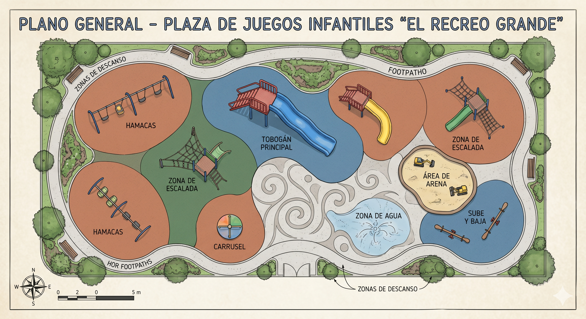

# Playground Plaza — "El Recreo Grande"

Plaza de juegos infantiles en 3D construida en Unity URP. Proyecto de
experimentación tratado como proyecto profesional: GitHub Project como tablero
Kanban, GitFlow simplificado, CI con lint + SonarCloud en cada PR.

---

## Plano de referencia



El plano `docs/plano_plaza.png` es la fuente de verdad del diseño. Cada elemento
visible en el plano tiene (o debería tener) un issue en el backlog asociado a
su epic correspondiente.

---

## Stack

- **Unity 6** con URP (Universal Render Pipeline)
- **Input System** (nuevo)
- **glTFast 6.x** (`com.unity.cloud.gltfast`) para importar modelos `.glb`

## Estructura del repositorio

```
playground-plaza/
├── Assets/
│   └── _Project/                  ← TODO nuestro contenido va aquí
│       ├── Art/
│       │   ├── Materials/         ← Grass, Sand, Wood, Red, Yellow, Blue
│       │   └── Models/            ← .glb / .fbx importados
│       ├── Prefabs/
│       │   └── Playground/        ← Slide.prefab, Swings.prefab, etc.
│       ├── Scenes/
│       │   └── Playground/        ← Playground.unity (escena principal)
│       └── Scripts/               ← código C#
├── docs/                          ← documentación, plano, capturas
├── .github/workflows/             ← pipeline de PRs (lint + SonarCloud)
├── .editorconfig                  ← reglas de estilo C#
└── CONTRIBUTING.md                ← flujo de trabajo (GitFlow + naming)
```

## Convenciones de la escena

La escena `Playground` está organizada en containers raíz con prefijo `_`
(para que queden arriba en el Hierarchy):

```
Playground
├── _Environment   (terreno, piso, bordes)
├── _Lighting      (luz direccional, Global Volume)
├── _Gameplay      (juegos: tobogán, hamacas, etc.)
└── _Cameras       (cámara principal)
```

## Gestión de tareas

- **Repo:** https://github.com/guiddodg/playground-plaza
- **Tablero Kanban:** https://github.com/users/guiddodg/projects/1

**Epics (6):**
| # | Epic | Criterio |
|---|------|----------|
| #13 | Juegos de Plaza | Elementos físicos de juego (tobogán, hamacas, carrusel, sube y baja, escalada) |
| #14 | Entorno | Mundo y escenografía (terreno, cielo, árboles, caminos, cercado, fuente) |
| #15 | Arte & Visuales | Materiales, texturas, iluminación, post-processing |
| #16 | Jugador | Personaje 3rd person (modelo, movimiento, cámara, animaciones) |
| #17 | Interacciones | Cómo el jugador usa los juegos (subirse al tobogán, mecerse, etc.) |
| #18 | Audio | Música y efectos de sonido |

**Milestones:**
- `v0.1 — Base de la plaza` ✅ (cerrado)
- `v0.2 — Elementos de juego` 🚧 (en curso)
- `v0.3 — Pulido` ⏳

## Flujo de trabajo

Ver [CONTRIBUTING.md](CONTRIBUTING.md) para el detalle del git flow. Resumen:

```bash
# Cada issue → su rama desde develop
git checkout develop && git pull
git checkout -b feature/N-nombre-corto

# Commit referenciando el issue
git commit -m "feat: descripcion (#N)"

# PR a develop (no a master)
git push -u origin feature/N-nombre-corto
gh pr create --base develop --title "feat: ..." --body "Closes #N"
```

Cada PR dispara automáticamente:
- ✅ **Lint** (EditorConfig)
- ✅ **Code review** (SonarCloud)

## Estado actual

| Sistema | Estado |
|---------|--------|
| Escena Playground | ✅ |
| Terreno + piso | ✅ |
| Cielo + luz diurna | ✅ |
| Tobogán | ✅ (modelo .glb) |
| Hamacas | ⏸️ bloqueado (esperando modelo) |
| Carrusel, sube y baja, escalada | ⏸️ bloqueado (esperando modelos) |
| Personaje + movimiento | ⏳ pendiente |
| Post-processing | ⏳ pendiente |
| Audio | ⏳ pendiente |
